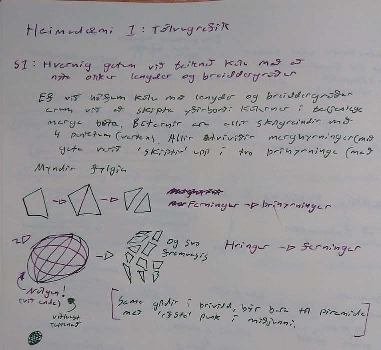
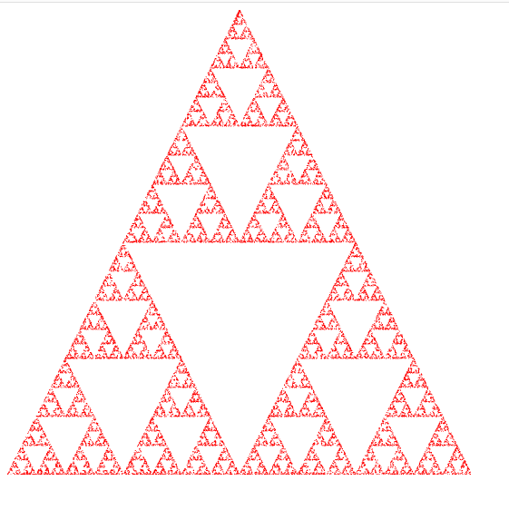

# Heimadæmi 1 ~ Tőlvugrafík

## D1

## D2

a) Innri bandvidd er 3500 GB/s
b) Lithradi skjápunkta 368.8 GB/s fyrir base clock speed (1900 Mhz)
c) Ytri bandvídd er 960 GB/s 
d) Hámarks Skjáupplaun er 8K (7680 × 4320) med 165 Hz med UHDTV2 skjastadalinum

## D3

WebGPU er nýrri API sem er hannadur til ad gefa forritaranum meiri "lower level" stjorn a grafíksforrituninni. þetta gerir WebGPU hradara. Gefur forriturum meiri stjórn yfir hvad þeir vilja gera. 

## D4

gLTF er stadall til aðallega til ad geta deilt og birt tölvugrafíks assetum. JPEG fyrir tolvugrafik.

## D5

---

Óðinn Ágústsson
