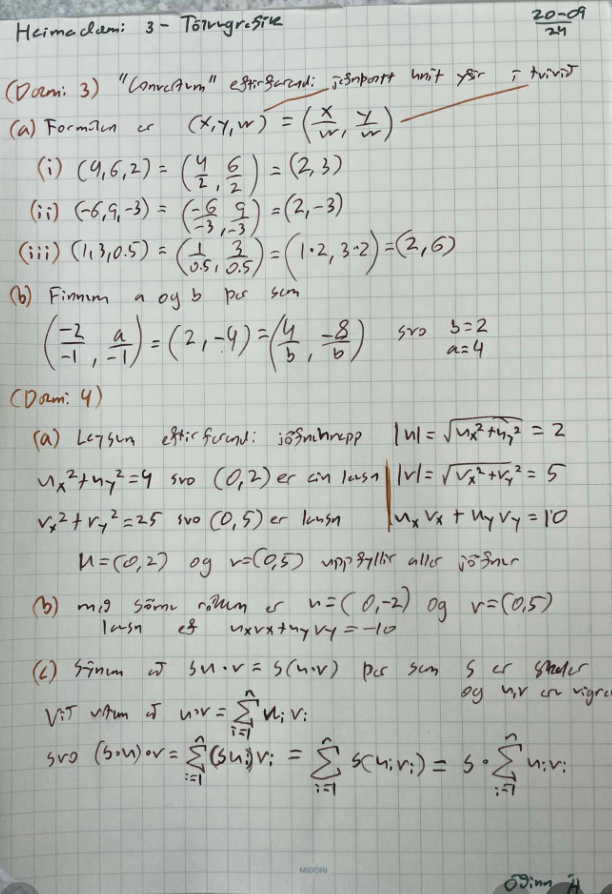

# Heimadæmi 3 ~ Tölvugrafík

- [Linkur á öll forritin](https://odinn-web-gl.netlify.app)
- [Linkur á github kóða](https://github.com/koltepri/WebGl-Odin)

\pagebreak

## Dæmi 1

Hægt er að skipta um lit með space, scroll virkar og færa með músinni hálfvirkar
[Linkur a forrit](https://odinn-web-gl.netlify.app/hw4/moveable_gasket)

## Dæmi 2

[Linkur a forrit](https://odinn-web-gl.netlify.app/hw4/shadercircle)

## Dæmi 3,4



## Dæmi 5

```
planeNormal = findNormal(3 initial points)
for p1,p2,p3 in allPoints do 
    assert p1 == p2 == p3
    if planeNormal != findNormal(p1,p2,p3)
        return false


return true
```

---

Óðinn Ágústsson
